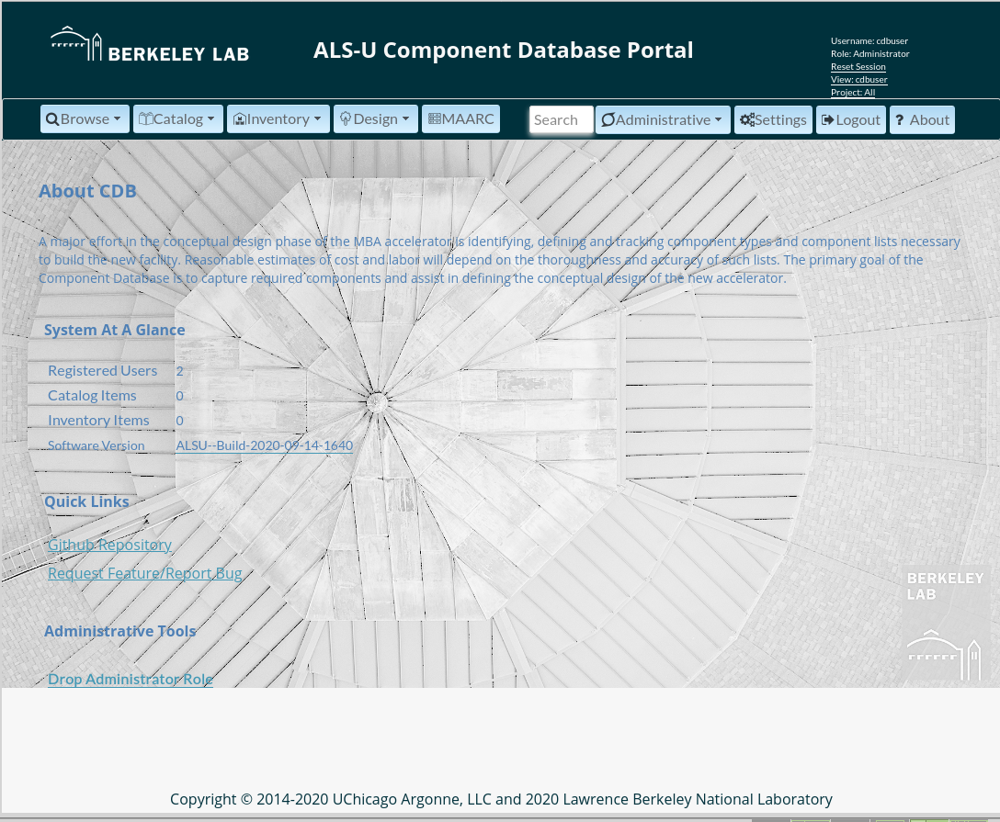

# ComponentDB-env


Configuration Environment for ComponentDB at <https://github.com/AdvancedPhotonSource/ComponentDB>

## Notice

This is not the fully functional repository, but **WIP** one.

## Requirements

### Define the Payara installation location

The default path is defined in `CONFIG_COMMON` as follows:

```bash
PAYARA_INSTALL_PATH:=/opt/payara/5.192
```

### Download the ComponentDB source under this repository

```bash
make init
```

* If there are patch files, please run

```bash
make patch.apply
```

### Install packages

```bash
make install.pkgs
```

For CentOS8, one should define which python2 should be used as default via

```bash
$ sudo update-alternatives --config python
There are 3 programs which provide 'python'.

  Selection    Command
-----------------------------------------------
*+ 1           /usr/libexec/no-python
   2           /usr/bin/python3
   3           /usr/bin/python2

Enter to keep the current selection[+], or type selection number: 3
```

### MariaDB configuration

* Check the mariadb status

```bash
$ systemctl status mariadb
● mariadb.service - MariaDB 10.3.22 database server
   Loaded: loaded (/lib/systemd/system/mariadb.service; enabled; vendor preset:
   Active: active (running) since Wed 2020-07-29 15:28:12 PDT; 1h 54min ago
     Docs: man:mysqld(8)
```

* Define all DB varialbes in `configure/CONFIG_COMMON` or its `CONFIG_COMMON.local`. For example,

```bash
DB_ADMIN_HOSTS="localhost 127.0.0.1 10.0.0.200"
DB_HOST_IPADDR=127.0.0.1
DB_HOST_PORT=3306
DB_HOST_NAME=localhost
DB_ADMIN=admin
DB_ADMIN_PASS=admin
DB_NAME=cdb
DB_USER=cdbpayara
DB_USER_PASS=cdbpayara
CDB_USER=cdbuser
CDB_USER_PASS=cdbuser
```

* Generate `mariadb.conf` file for a script

```bash
make db.conf
```

* Secure Setup and add administor : only need to do at the beginning of MariaDB configuration

```bash
make db.secure
```

* Add the admin user account for SQL Database. We use the default `root` through `unix_socket` to connect the SQL server, so we would like to create `admin` account to let users allow to connect the database without `unix_socket`.

```bash
make db.addAdmin
```

One can remove it via `make db.rmAdmin`.

* Create DB and its corresponding *SQL* user account (By default, `cdb` is used for `mysql.user`) for the connection from `Payara` and `MariaDB (MySQL)` server. Note that the same user name uses everywhere, so please identify it correctly.

```bash
make db.create
make db.show
```

* Create all tables and populate all sql files for ComponentDB

```bash
make cdb.create
make cdb.show
```

* Update the local user password

```bash
make cdb.admin
```

#### Reset the Database

```bash
make db.drop
make db.create
make cdb.create
make cdb.admin
```

or

```bash
make cdb.reinit
```

### Paraya Server Configuration

Almost generic installation and configuration are done in the external repository. Please see it the further configuration [1].

* Check the payara service

```bash
systemctl status payara
```

* Start the Paraya service

```bash
sudo systemctl start payara
```

* Install jdbc into the running payara server.
Here we use the `mariadb-java-client-2.3.0.jar`[1] instead of the mysql client.

```bash
make jdbc.conf
make jdbc.install
```

We can check the connection via

```bash
make jdbc.ping
```

** More `makefile` rules

```bash
make jdbc.conf             : Build   payara_mariadb_jdbc_template.xml in SITE_TEMPLATE_PATH
make jdbc.conf.show        : Print   payara_mariabd_jdbc_template.xml
make jdbc.install          : Install it to the running payara server
make jdbc.ping             : Do ping-connection-pool
make jdbc.list             : Do list-jdbc-connection-pools
make jdbc.flush            : Do flush-connection-pool
make jdbc.uninstall        : Delete resource and connection-pool
make jdbc.resouces.rm      : Do delete-jdbc-resource
make jdbc.pool.rm          : Do delete-jdbc-connection-pool
```

## Build

```bash
make build
make deploy.cdb
```

** More `makefile` rules for `asadmin`

```bash
make undeploy.cdb          : undeploy the CDB application
make redeploy.cdb          : undeploy and deploy the CDB application
make list.cdb              : list all available application -list-application
```

||
| :---: |
|**Figure 1** Firefox CDB About Page Screenshot.|

||
| :---: |
|**Figure 2** Chrome CDB Catalog Page Screenshot.|

||
| :---: |
|**Figure 3** Chrome CDB About Page Screenshot.|

## CDB Web Service

## References

[1] <https://github.com/jeonghanlee/Payara-env>

[2] <https://github.com/jeonghanlee/Payara-env/blob/ee8b8993d895d6c01c21628b43208f7e55353f4b/configure/CONFIG_COMMOM#L8-L20>
