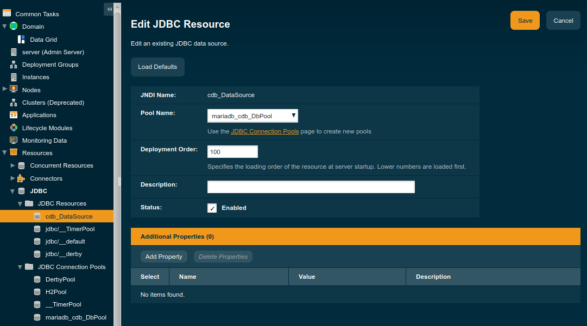
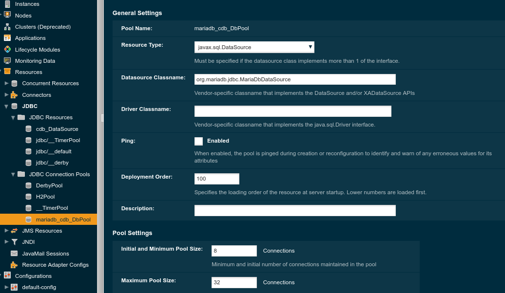

# CDB Specific Payara Configuration

## JDBC Configuration

`Payara-env` has already configured with `mariadb-java-client-2.6.1.jar`.

* Start the Paraya service

```bash
sudo systemctl start payara
```

* `makefile` rules

```bash
make jdbc.conf             : Build   payara_mariadb_jdbc_template.xml in SITE_TEMPLATE_PATH
make jdbc.conf.view        : Print   payara_mariabd_jdbc_template.xml
make jdbc.install          : Install it to the running payara server
make jdbc.ping             : Do ping-connection-pool
make jdbc.list             : Do list-jdbc-connection-pools
make jdbc.flush            : Do flush-connection-pool
make jdbc.uninstall        : Delete resource and connection-pool
make jdbc.resouces.rm      : Do delete-jdbc-resource
make jdbc.pool.rm          : Do delete-jdbc-connection-pool
```

* Setup JDBC with outputs

```bash
ComponentDB-env (master)$ make vars FILTER=JDBC_

------------------------------------------------------------
>>>>          Current Envrionment Variables             <<<<
------------------------------------------------------------

JDBC_DATASOURCE_CLASSNAME = org.mariadb.jdbc.MariaDbDataSource
JDBC_DB_CONNECTION_POOLNAME = mariadb_cdb_DbPool
JDBC_DB_HOSTNAME = localhost
JDBC_DB_NAME = cdb
JDBC_DB_PORTNUM = 3036
JDBC_DB_TYPE = mariadb
JDBC_DB_USER = cdb
JDBC_DB_USER_PASS = cdb
JDBC_JNID_NAME = cdb_DataSource
JDBC_PAYARA_MARIADB_XML = payara_mariadb_jdbc_template.xml
JDBC_RES_TYPE = javax.sql.DataSource

ComponentDB-env (master)$ make jdbc.conf
....
    79  <resources>
    80      <jdbc-connection-pool
    81          name="mariadb_cdb_DbPool"
    82          datasource-classname="org.mariadb.jdbc.MariaDbDataSource"
    83          res-type="javax.sql.DataSource">
    84          <property name="user" value="cdb"/>
    85          <property name="password" value="cdb"/>
    86          <property name="url" value="jdbc:mariadb://127.0.0.1:3306/cdb?zeroDateTimeBehavior=convertToNull"/>
    87      </jdbc-connection-pool>

    88      <jdbc-resource
    89          enabled="true"
    90          jndi-name="cdb_DataSource"
    91          object-type="user"
    92          pool-name="mariadb_cdb_DbPool"/>
    93  </resources>

ComponentDB-env (master)$ make jdbc.install
/opt/payara/bin/asadmin add-resources /home/jhlee/gitsrc/ComponentDB-env/site-template/payara_mariadb_jdbc_template.xml
Authentication failed with password from login store: /home/jhlee/.gfclient/pass
Enter admin password for user "admin">
JDBC connection pool mariadb_cdb_DbPool created successfully.
JDBC resource cdb_DataSource created successfully.
Command add-resources executed successfully.

jhlee@parity: ComponentDB-env (master)$ make jdbc.ping
/opt/payara/bin/asadmin ping-connection-pool mariadb_cdb_DbPool
Authentication failed with password from login store: /home/jhlee/.gfclient/pass
Enter admin password for user "admin">
Command ping-connection-pool executed successfully.

ComponentDB-env (master)$ make jdbc.list
/opt/payara/bin/asadmin list-jdbc-connection-pools mariadb_cdb_DbPool
Authentication failed with password from login store: /home/jhlee/.gfclient/pass
Enter admin password for user "admin">
__TimerPool
DerbyPool
H2Pool
Command list-jdbc-connection-pools executed successfully.

```

## Screenshots

||
| :---: |
|**Figure 1** Payara JDBC resources screenshot. |

||
| :---: |
|**Figure 2** Payara JDBC connection pools screenshot. |
